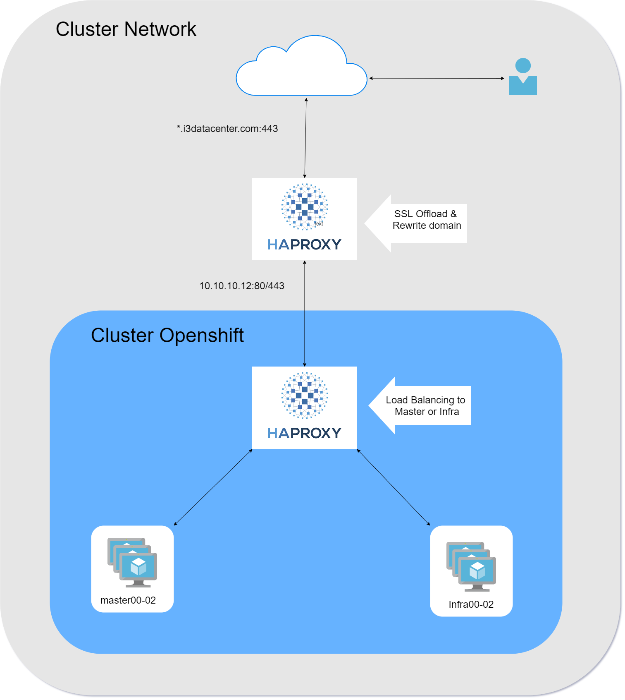
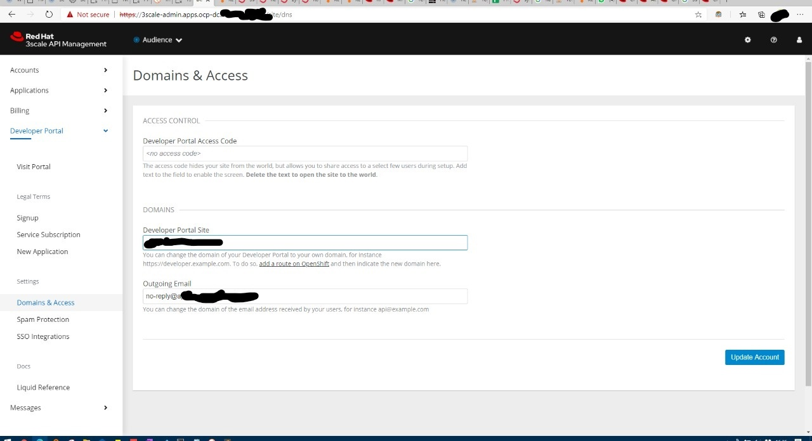

# Rewrite Domain and SSL Offload in HAProxy 
## Scenario
1. there are 4 subdomain that needs to be forwarded as OCP internal domain
<table>
	<thead>
		<tr>
			<th>External URL</th>
			<th>Internal URL</th>
		</tr>
	</thead>
	<tbody>
		<tr>
			<td>portal.i3datacenter.com</td>
			<td>3scale.apps.ocp.i3datacenter.com</td>
		</tr>
		<tr>
			<td>sso.i3datacenter.com</td>
			<td>sso.apps.ocp.i3datacenter.com</td>
		</tr>
		<tr>
			<td>api.i3datacenter.com/prod/*</td>
			<td>prod-api-product-3scale-apicast-production.apps.ocp.i3datacenter.com</td>
		</tr>
		<tr>
			<td>api.i3datacenter.com/dev/*</td>
			<td>dev-api-product-3scale-apicast-production.apps.ocp.i3datacenter.com</td>
		</tr>
	</tbody>
</table>

2. The System Architecture

3. 3Scale configurations. You need to edit your Development Portal domain or URL from it's administrator or tenant (3scale-admin).

4. SSO configurations. You need to edit your SSO's Route resource.
